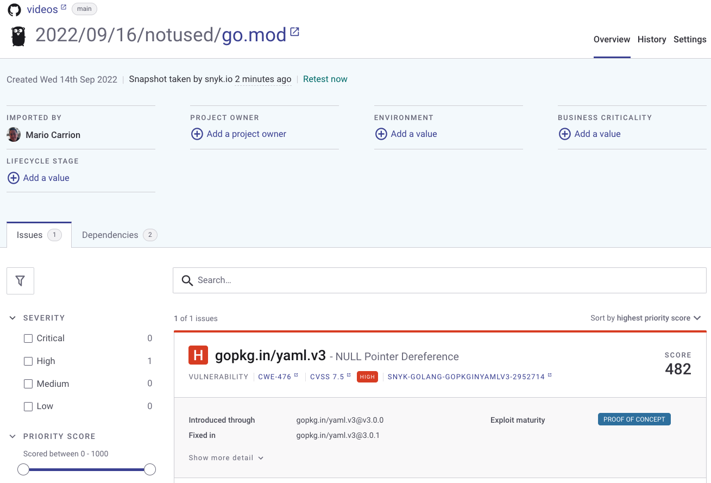

# Go Vulnerability found but not used!

* [Go Package Discovery](https://pkg.go.dev/gopkg.in/yaml.v3?tab=versions)

Run `govulncheck ./...`, it will return a vulnerability **but** it will indicate it's ok because we are not calling the function.

Notice how other tools/services such as [Snyk](https://snyk.io/), still report it:

