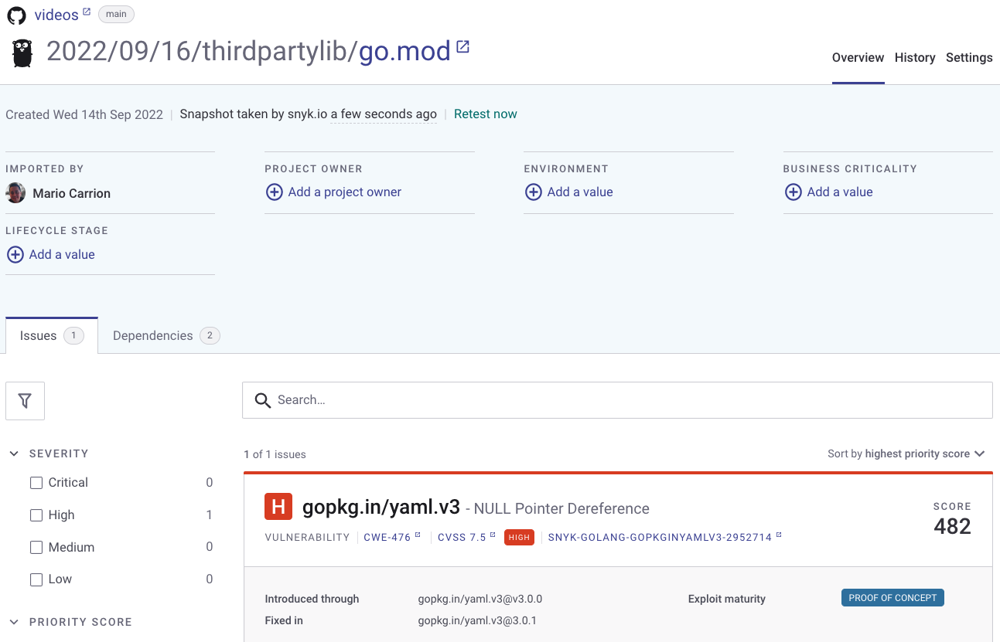

# Go Vulnerability in Third Party library

Compile the binary:

```
go build .
```

Run `govulncheck thirdpartylib`, it will return a vulnerability.

This report is similar to other tools/services such as [Snyk](https://snyk.io/):


